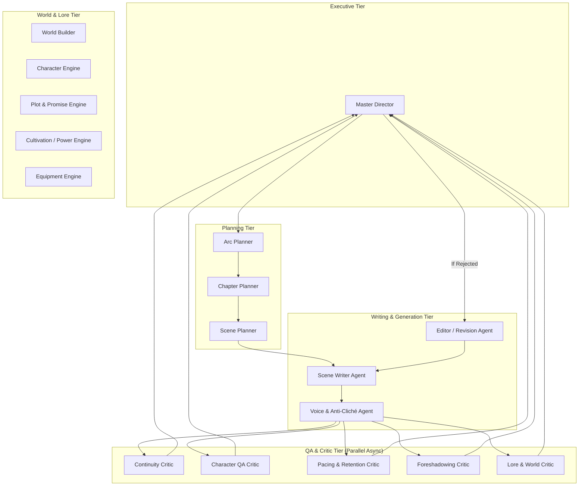

# NovelForge AI — Agent Architecture & Swarm Specification

## 1. Agent Swarm Topology

NovelForge AI deploys 18 specialized agents structured into four functional tiers:
1. **Executive / Orchestration Tier**
2. **Planning & World-Building Tier**
3. **Execution & Prose Drafting Tier**
4. **Validation & Quality Assurance (QA) Tier**

---

## 2. Agent Roster & Detailed Specifications

### 2.1 Master Director
* **Role:** High-level pipeline coordinator and state arbiter.
* **Responsibilities:** Enforces the chapter pipeline progression, manages human-in-the-loop review triggers, and commits accepted chapters to canon.
* **Tool Permissions:** Full execution privileges over the pipeline; can transition status from `PROVISIONAL` to `CANON`.

### 2.2 Scene Writer Agent
* **Role:** Dedicated prose generation engine.
* **Input:** Scene blueprint, active character voice constraints, localized scene context, power boundaries.
* **Output:** 800–1,200 words of high-immersion narrative prose per scene beat.
* **Strict Constraints:**
  * Must NOT dump exposition or summaries.
  * Must strictly honor character knowledge states (cannot use unrevealed secrets).
  * Must adhere to banned-cliché negative constraints.

### 2.3 Cultivation / Power Rule Engine (Hybrid Deterministic + LLM)
* **Role:** Validates realistic combat capabilities and breakthrough conditions.
* **Mechanics:** Executes Python combat power formula before combat scenes:
  $$\text{Power Rating} = (\text{Realm Base}) \times (1 + \text{Technique Multiplier}) + \text{Artifact Bonuses}$$
* Returns strict feasibility verdicts (`ABSOLUTE_VICTORY`, `CONTESTED`, `IMPOSSIBLE`) to prevent plot-armor hallucinations.

### 2.4 Character QA Critic & Epistemic Guard
* **Role:** Evaluates whether characters act consistently with their stated personality, goals, and knowledge.
* **Validation Rule:** Flags any instance where Character A acts on knowledge reserved exclusively for Reader or Author.

### 2.5 Continuity Critic (Dual-Engine)
* **Fast-Path:** Deterministic entity/location regex checking (detects dead characters, duplicate names, impossible item ownership).
* **Deep-Path:** LLM reasoning review verifying timeline progression, travel distances, and causal chains.

### 2.6 Pacing & Reader Retention Critic
* **Role:** Evaluates chapter tension curves, opening hooks, and ending cliffhangers.
* **Scoring Rubric:**
  * Opening Hook Strength (0–10)
  * Escalation Velocity (0–10)
  * Cliffhanger / Hook Efficacy (0–10)
* Chapters with scores $<7.5$ trigger automated revision passes.

---

## 3. Tool Access Permissions Matrix

| Agent | Read State | Propose Mutation | Commit to Canon | Raw LLM Access |
| :--- | :---: | :---: | :---: | :---: |
| **Master Director** | ✅ | ✅ | ✅ | Tier 1 (Frontier) |
| **Arc & Chapter Planner** | ✅ | ✅ | ❌ | Tier 1 (Frontier) |
| **Scene Writer Agent** | ✅ | ❌ | ❌ | Tier 2 (Prose) |
| **Cultivation Engine** | ✅ | ✅ (Power events) | ❌ | Python Code + Tier 3 |
| **QA Critics** | ✅ | ❌ (Scores only) | ❌ | Tier 1/3 (Parallel) |
| **Revision Agent** | ✅ | ✅ (Prose diffs) | ❌ | Tier 2 (Prose) |
