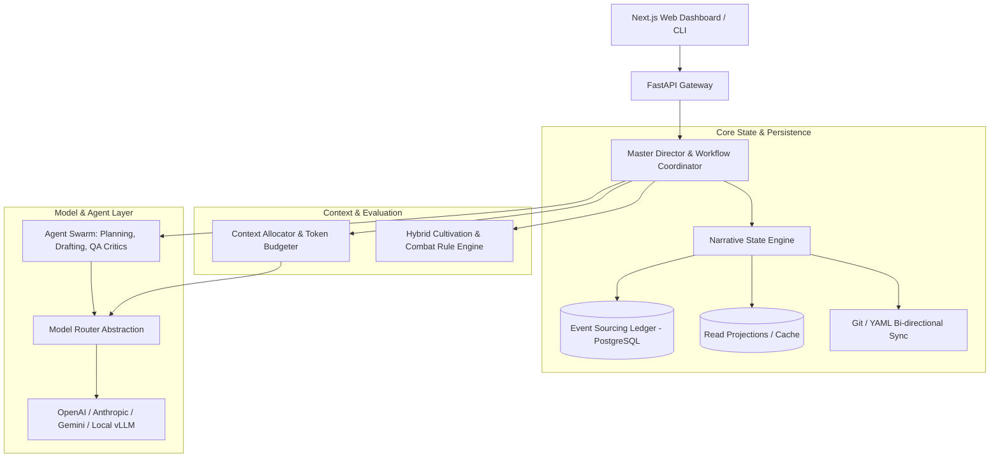

# NovelForge AI — System Architecture Specification

## 1. High-Level Architecture Topology

NovelForge AI is a **Persistent Narrative State Engine** designed for extremely long-form serialized fiction (1,000–5,000+ chapters). It separates deterministic narrative state from probabilistic LLM generation.

## 2. Core Architectural Pillars

### 2.1 The LLM is NOT the Database
* Large language models are strictly treated as stateless reasoning and synthesis workers.
* The application database (PostgreSQL) and the append-only event ledger store the authoritative story truth.
* No LLM prompt ever receives raw historical text dumps; context is assembled deterministically through token-budgeted extractors.

### 2.2 Event Sourcing & Story Mutation Ledger (CQRS)
* **The Problem:** In a 3,000-chapter story, in-place database updates (`UPDATE characters SET power = ...`) make it impossible to cleanly revert or branch when an author edits earlier chapters (the "Cascading Retcon" problem).
* **The Solution:** Every story change is stored as an immutable event in the `story_events` table:
  * e.g., `CharacterPromotedEvent`, `ItemTransferredEvent`, `SecretRevealedEvent`, `RelationshipUpdatedEvent`.
  * Events are ordered by `(saga_id, arc_id, chapter_index, scene_index, sequence_num)`.
* **State Projections:** Current world and character states are calculated by projecting events up to the target chapter.
* **Non-Destructive Time Travel:** Rolling back or branching into alternative storylines is a clean query: replay events up to `chapter_index = N`.

### 2.3 Bi-Directional Git & PostgreSQL Synchronization (SSOT)
* **PostgreSQL:** High-speed transactional store, event ledger, relationship graph queries, and pgvector semantic indexing.
* **Git Repository (Markdown & YAML):** Human-readable story assets (`stories/<story_id>/bible/`, `characters/`, `chapters/`).
* **Sync Rules:**
  * When a chapter/state change is approved, the system serializes the projection to YAML/Markdown and executes an automated Git commit.
  * Authors can edit YAML/Markdown directly; a `sync-yaml` service validates schemas and generates corresponding `HUMAN_EDIT` events into the event ledger.

### 2.4 Dynamic Context Budgeting & Token Allocator
To prevent "Lost in the Middle" attention degradation, prompt assembly uses strict token quotas:
* **Scene Beat Objective:** 15% of token budget
* **Active Characters (Voice profiles, knowledge, emotional state):** 25% of token budget
* **Immediate Scene Lore & Environment:** 10% of token budget
* **Power Rules & Combat Constraints:** 15% of token budget
* **Active Foreshadowing & Narrative Promises:** 10% of token budget
* **Rolling Immediate Preceding Scene Context:** 25% of token budget

### 2.5 Scene-by-Scene Iterative Generation Loop
Chapters (3,000–4,000 words) are never drafted in one inference call. The pipeline splits a chapter into 3–5 scene beats (800–1,200 words each):
1. **Scene Beat Planner:** Generates POV, objective, conflict, revelation.
2. **Rule Verification:** Python rule engine checks viability (combat power, inventory).
3. **Prose Generation:** Scene Writer generates prose under voice and anti-cliché constraints.
4. **Local State Update:** Micro-state shifts (injuries, item usage, clues) update the scene context before generating the next scene beat.
5. **Assembly & Transition Smoothing:** Scenes are stitched and polished.

### 2.6 Fast-Path vs. Deep-Path Parallel QA
* **Fast-Path (Deterministic, <50ms, $0 cost):** Regex and rule checkers verify character names, location validity, inventory ownership, and banned AI clichés.
* **Deep-Path (Async Parallel LLM Critics):** Concurrently runs Continuity, Character Voice, Pacing, and Foreshadowing critics via `asyncio.gather()`.
* **Targeted Revision:** Scores $<7.5$ trigger automated surgical revisions; scores $>8.5$ are marked ready for approval.
