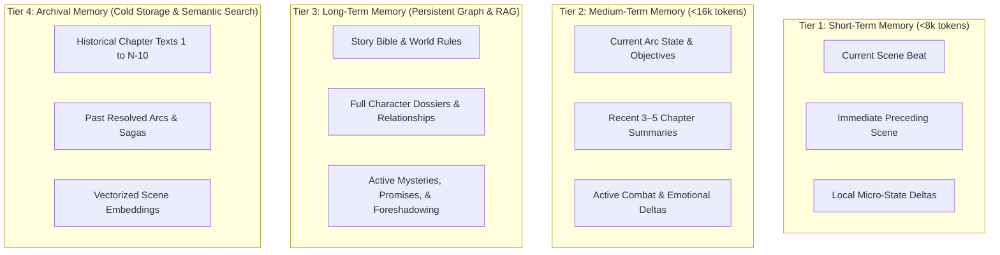

# NovelForge AI — Memory & Retrieval Architecture

## 1. Multi-Tiered Memory Hierarchy

To support stories exceeding 1,000–5,000 chapters without context explosion or hallucination, NovelForge AI partitions narrative memory into four distinct operational tiers:



---

## 2. Dynamic Context Budgeter & Token Allocation

Dumping raw memory into prompt contexts causes "Lost in the Middle" attention failure. The Context Allocator dynamically rations token capacity for each generation task:

### Token Allocation Budget (Standard 8,000-token Prompt Budget)
| Component | Budget Share | Target Tokens | Retrieval Policy |
| :--- | :---: | :---: | :--- |
| **Scene Objective & Core Beat** | 15% | ~1,200 tokens | Exact blueprint instructions and goal |
| **Active Present Characters** | 25% | ~2,000 tokens | Strict filter: only characters physically in the scene |
| **Immediate Location & Atmosphere** | 10% | ~800 tokens | Environmental features, weather, sensory details |
| **Cultivation / Power Matrix** | 15% | ~1,200 tokens | Boundary ratings, active martial techniques |
| **Target Foreshadowing & Promises** | 10% | ~800 tokens | Only clues/promises targeted for this scene |
| **Rolling Recent Scene Window** | 25% | ~2,000 tokens | Unbroken prose from previous 1–2 scenes for flow |

---

## 3. Epistemic Separation & Relevance Filtering

### 3.1 Proximity & Presence Gating
Before assembling character memory into the prompt context:
1. Identify `present_character_ids` for the current scene.
2. Load only the dossiers, voice profiles, and equipment of `present_character_ids`.
3. Filter out non-present characters unless explicitly mentioned in the scene's conversational objective.

### 3.2 Epistemic Gate (Preventing Accidental Spoilers)
When retrieving knowledge facts for character dialogue or POV internal monologue:
* An SQL filter checks:
  ```sql
  SELECT fact_key, description 
  FROM character_knowledge_states 
  WHERE character_id = :pov_character_id AND character_knowledge = TRUE;
  ```
* Facts where `character_knowledge = FALSE` are explicitly injected into the prompt's **Negative Knowledge Header**:
  ```markdown
  [CRITICAL: CHARACTER KNOWLEDGE BOUNDARY]
  The POV character does NOT know:
  - That Sect Elder Han poisoned the well.
  - That the Ancient Relic is buried under the South Pagoda.
  Under NO circumstances may the character mention, suspect, or act on these facts.
  ```

---

## 4. Archival Retrieval Engine (Hybrid Semantic + Chronological)

When deep historical lore is required:
1. **Temporal Filtering:** Limit search to specific sagas or chapters.
2. **Hybrid Scoring:**
   $$\text{Score} = \alpha \cdot \text{CosineSimilarity}(\vec{q}, \vec{d}) + \beta \cdot \text{RecencyWeight} + \gamma \cdot \text{EntityMatch}$$
3. Embeddings are stored in PostgreSQL using `pgvector` (`vector(1536)`).
