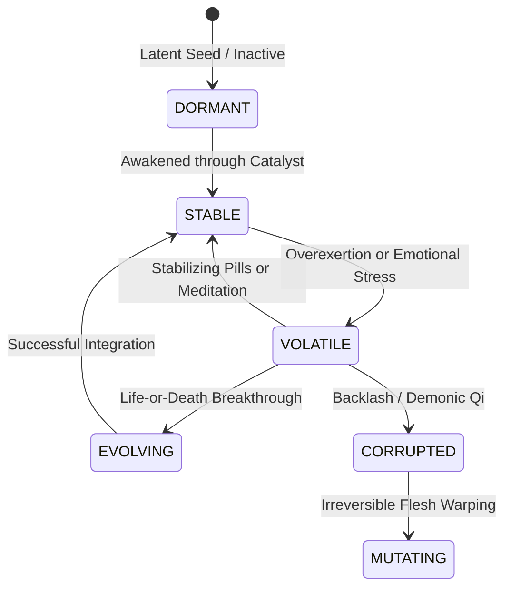

# NovelForge AI — Mutation Engine Architecture & Design
**Phase 3: 10-Category Mutation System & Epistemic Visibility**

---

## 1. Overview

The Mutation Engine manages bodily, energetic, and spiritual alterations that differentiate characters from standard realm practitioners. Mutations provide asymmetric combat advantages, unexpected narrative twists, and progressive physical or mental transformations.

---

## 2. The 10 Mutation Categories

| Category | Description | Primary Effects | Typical Drawbacks |
| :--- | :--- | :--- | :--- |
| **Biological** | Flesh, skin, muscle, and dermal adaptations | Armor plating, kinetic absorption, claws | Increased caloric/energy consumption |
| **Energetic** | Alteration of energy pathways and meridian flow | Lightning conversion, icy Qi, fire veins | Vulnerability to meridian overheating |
| **Skeletal** | Bone hardening, marrow metamorphosis, wing growth | Unbreakable bones, piercing spurs | Increased body mass, reduced flexibility |
| **Sensory** | Compound eyes, thermal vision, omnidirectional hearing | Immune to visual feints, detects stealth | Sensory overload in noisy/bright zones |
| **Organ** | Secondary heart, venom gland, auxiliary lungs | Breath-holding, internal poison synthesis | Toxic buildup if gland is punctured |
| **Bloodline** | Ancestral beast awakening, dragon marrow | Burst strength, draconic scales, intimidation | Bloodline frenzy / berserk triggers |
| **Soul** | Reincarnation imprints, split soul consciousness | Telepathy, ghost perception, illusion immune | Susceptible to spiritual backlash |
| **Symbiotic** | Living parasites, shadow entities, blood worms | Autonomous defense, wound suturing | Constant host nourishment demand |
| **Spatial** | Pocket dimension stomach, localized gravity warp | Teleportation blinks, void grasping | Spatial nausea, anchor instability |
| **Void / Eldritch** | Cosmic horror communion, eye of the outer void | Conceptual negation, sanity piercing | Sanity erosion, corruption instability |

---

## 3. Stability Lifecycle

Mutations are not static; they progress through six distinct stability states:

1. **DORMANT**: Inactive genetic or soul imprint. No stat bonus; invisible to ordinary perception.
2. **STABLE**: Balanced integration. Stat modifiers operate with minimal side-effects.
3. **VOLATILE**: Fluctuating potency. Stat bonuses increase by 25%, but trigger chances for damage or loss of control rise.
4. **EVOLVING**: Active metamorphosis toward a higher tier mutation.
5. **CORRUPTED**: The mutation begins cannibalizing the host's vitality or Qi.
6. **MUTATING**: Wild, uncontrolled morphological divergence.

---

## 4. Epistemic Visibility & Secret Mutations

To support mystery, dramatic irony, and protagonist trump cards, mutations feature strict epistemic access control:

- **`hidden_from_character`**:
  - If `True`, the character does not realize they carry this mutation (e.g. Lin Xia's dormant *Sovereign Vessel* core, or an unknown eldritch parasite).
  - Narrative writing agents must NOT narrate internal awareness of this trait from the character's POV.
- **`hidden_from_world`**:
  - If `True`, outside observers, rivals, and elders cannot detect the mutation through ordinary spiritual scanning (e.g. Lin Chen's *Reincarnator Soul Eye*).
  - Scene power context filters this out when rendering opponent assessments.
