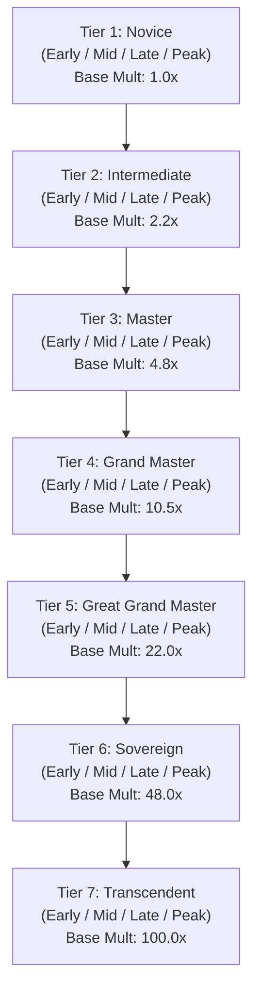

# NovelForge AI — Power System Architecture & Design
**Phase 3: The Authoritative Physics Engine of the Novel Universe**

---

## 1. Overview & Core Philosophy

The Power Engine within NovelForge AI serves as the **deterministic physics engine** for cultivation, awakening, magic, and progression fantasy universes. The LLM is strictly prohibited from inventing arbitrary cultivation breakthroughs, ignoring realm bottlenecks, or forgetting power laws across long narrative arcs.

Every character's strength is represented numerically and multidimensionally, persisting across chapters, arcs, and multi-thousand chapter sagas.

---

## 2. Multi-System Architecture

NovelForge AI supports multiple concurrent power systems within a single story universe:

| System Type | Core Energy | Progression Mechanism | Example Genres |
| :--- | :--- | :--- | :--- |
| **Cultivation** | Qi / True Essence | Meridian circulation, core condensation, tribulation | Xianxia, Xuanhuan |
| **Mutation** | Gene / Bio-Essence | Environmental radiation, flesh restructuring, organ evolution | Sci-Fi, Post-Apocalyptic |
| **Awakening** | Psychic / Aether | Trauma triggers, awakening stones, tier gates | Urban Fantasy, LitRPG |
| **Martial Arts** | Internal Force | Physical conditioning, weapon intent, bodily marrow | Wuxia, Low Fantasy |
| **Magic** | Mana / Arcana | Spell circle formation, soul sea expansion, elemental pacts | Western Fantasy |
| **Tech / Cyber** | Power Cells / Nanites | Cybernetic implants, hardware upgrades, wetware overclocks | Cyberpunk, Sci-Fi |
| **Soul** | Spiritual Force | Ghost resonance, ancestral soul communion, soul weapons | Occult, Supernatural |
| **Hybrid** | Mixed Energy | Dual cultivation, bio-magical synthesis, soul-machine fusion | Modern Cultivation |

---

## 3. The 7-Tier Canonical Ladder

The default cultivation/awakening ladder consists of 7 configurable tiers:

### Sub-Realms (Stages)
Every tier contains four standard sub-stages:
- **Early Stage** ($1.00\times$ stage multiplier): Initial entry into realm. Energetic pathways adapt.
- **Mid Stage** ($1.25\times$ stage multiplier): Consolidation of energy. Core density increases.
- **Late Stage** ($1.55\times$ stage multiplier): Saturation point. Aura begins leaking into environment.
- **Peak Stage** ($1.90\times$ stage multiplier): Bottleneck reached. Energy must be compressed or catalyzed to advance.

---

## 4. 12-Dimensional Power Vector

Rather than a single scalar "level", character combat capacity is modeled across 12 distinct vector dimensions:

$$\mathbf{P} = \langle P_{\text{phys}}, P_{\text{ener}}, P_{\text{spd}}, P_{\text{dur}}, P_{\text{perc}}, P_{\text{ment}}, P_{\text{tech}}, P_{\text{comb}}, P_{\text{ctrl}}, P_{\text{adapt}}, P_{\text{regen}}, P_{\text{spec}} \rangle$$

1. **Physical ($P_{\text{phys}}$)**: Raw muscular, skeletal, and kinetic strike potency.
2. **Energy ($P_{\text{ener}}$)**: Total Qi/mana capacity, throughput, and aura projection.
3. **Speed ($P_{\text{spd}}$)**: Movement velocity, acceleration, and reflex reaction speed.
4. **Durability ($P_{\text{dur}}$)**: Resistance to blunt, piercing, elemental, and explosive trauma.
5. **Perception ($P_{\text{perc}}$)**: Divine sense, visual acuity, hearing, and spatial awareness.
6. **Mental ($P_{\text{ment}}$)**: Willpower, psychic resistance, illusion immunity, and mental fortitude.
7. **Technique ($P_{\text{tech}}$)**: Martial efficiency, kinetic leverage, and energy waste elimination.
8. **Combat Skill ($P_{\text{comb}}$)**: Tactical battle IQ, feints, intuition, and adaptation under fire.
9. **Control ($P_{\text{ctrl}}$)**: Micro-manipulation of energy pathways, thread control, and precision.
10. **Adaptability ($P_{\text{adapt}}$)**: Resistance to poisons, extreme gravity, dimensional pressure, and debuffs.
11. **Regeneration ($P_{\text{regen}}$)**: Cellular, bone, and energetic recovery rate in and out of combat.
12. **Special Ability ($P_{\text{spec}}$)**: Conceptual hax, bloodline abilities, spatial arts, and unique mutations.

### Effective Combat Rating Formula
The raw combat rating is calculated deterministically as:
$$R_{\text{raw}} = \left( \sum_{i=1}^{12} P_i \right) \times 2^{(\text{tier} - 1)} \times M_{\text{stage}}$$

Where $M_{\text{stage}} \in \{1.00, 1.25, 1.55, 1.90\}$.

---

## 5. Potential & Ceiling Mechanics

Characters possess an intrinsic `PowerPotential`:
- **Ceiling Tier**: The maximum tier attainable through standard meditation and cultivation.
- **Bottleneck Difficulty**: Multiplier representing meridian obstruction or comprehension deficits.
- **Ceiling Breakthroughs**: Advancing past the ceiling requires extraordinary catalysts (e.g. Divine Marrow Washing, Ancestral Soul Reconstruction, or Mythic Mutations).
