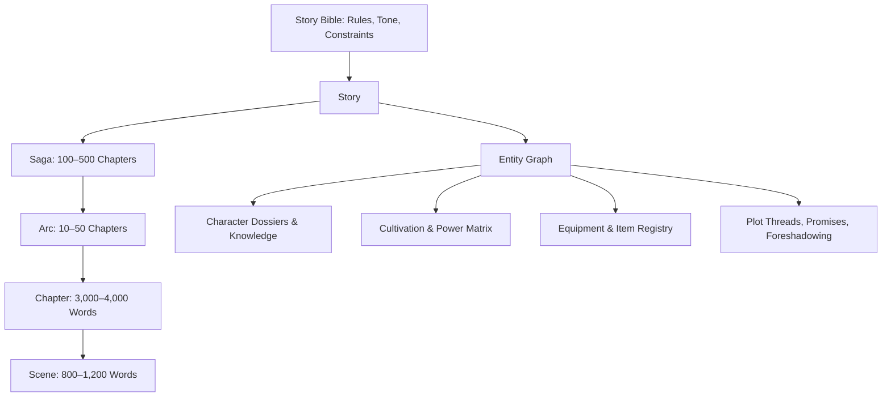

# NovelForge AI — Story Schema & Entity Specifications

## 1. Core Schema Hierarchy

The story data architecture is strictly defined using Pydantic v2 schemas and mirrored across PostgreSQL tables and human-readable YAML story files.



---

## 2. Pydantic Entity Models

### 2.1 Character Schema (`CharacterDossier`)
```python
from pydantic import BaseModel, Field
from typing import List, Dict, Optional
from uuid import UUID

class CharacterVoiceProfile(BaseModel):
    sentence_cadence: str # e.g. "short, clipped, authoritative"
    vocabulary_tier: str # e.g. "archaic, formal classical scholar"
    verbal_tics: List[str] # e.g. ["Humph!", "Courting death!"]
    formality_level: float # 0.0 (vulgar street slang) to 1.0 (imperial formal)
    banned_words: List[str]

class CharacterCultivation(BaseModel):
    realm: str # e.g., "Foundation Establishment"
    sub_realm: str # e.g., "Late Stage"
    rank_level: int # Numeric rank for deterministic combat evaluation
    active_techniques: List[str]
    bottleneck_description: Optional[str] = None
    spiritual_root: str # e.g., "Heavenly Lightning Root"

class CharacterDossier(BaseModel):
    id: UUID
    name: str
    alias_list: List[str] = []
    age: int
    gender: str
    personality_traits: List[str]
    core_fear: str
    driving_want: str
    core_wound: str
    voice_profile: CharacterVoiceProfile
    cultivation: CharacterCultivation
    current_location_id: UUID
    equipped_item_ids: List[UUID] = []
    is_alive: bool = True
```

### 2.2 Cultivation Power System Schema (`CultivationSystem`)
```python
class CultivationRealm(BaseModel):
    name: str
    tier_order: int # 1, 2, 3...
    sub_realms: List[str] # ["Early", "Middle", "Late", "Peak"]
    base_power_index: float
    breakthrough_tribulation: bool
    lifespan_years: int
    physical_limits_description: str

class CultivationSystem(BaseModel):
    system_name: str # e.g. "Nine Heavens Golden Dan Path"
    energy_type: str # e.g. "Qi", "Spiritual Essence", "Aether"
    realms: List[CultivationRealm]
    power_scaling_rules: str
```

### 2.3 Narrative Promise Schema (`NarrativePromise`)
```python
class NarrativePromise(BaseModel):
    id: UUID
    title: str
    description: str
    introduced_chapter: int
    expected_payoff_window: tuple[int, int] # e.g. (300, 500)
    urgency_status: str # "OPEN", "ACTIVE", "APPROACHING_PAYOFF", "OVERDUE", "RESOLVED"
    associated_character_ids: List[UUID] = []
```

### 2.4 Foreshadowing Schema (`ForeshadowingRecord`)
```python
class ClueRecord(BaseModel):
    chapter_index: int
    scene_index: int
    clue_text: str
    subtlety_rating: int # 1 (obvious) to 10 (cryptic)

class ForeshadowingRecord(BaseModel):
    id: UUID
    seed_chapter: int
    clues_planted: List[ClueRecord] = []
    intended_red_herring: str # False interpretation
    true_underlying_secret: str
    planned_payoff_chapter: int
    importance: str # "MINOR", "MAJOR", "SERIES_FINALE"
    is_revealed: bool = False
```

### 2.5 Event Sourcing Ledger Payload Schema (`StoryEventPayload`)
```python
class StoryEvent(BaseModel):
    event_id: UUID
    story_id: UUID
    chapter_number: int
    scene_number: int
    sequence_num: int
    event_type: str # CHARACTER_PROMOTED, ITEM_TRANSFERRED, SECRET_REVEALED, etc.
    entity_type: str
    entity_id: UUID
    delta: Dict[str, str]
    author: str # "AI" or "HUMAN"
```
