# Chapter 1: The Cracking Stacks (Illustrated Edition)
*From: The Omnicrafter of the Fallen Era*

---

## Visual Concept Anchors

| **Arthur Vance (Protagonist)** | **Grand Municipal Library Archive** | **Barnaby the Camp Rat** |
| :---: | :---: | :---: |
| 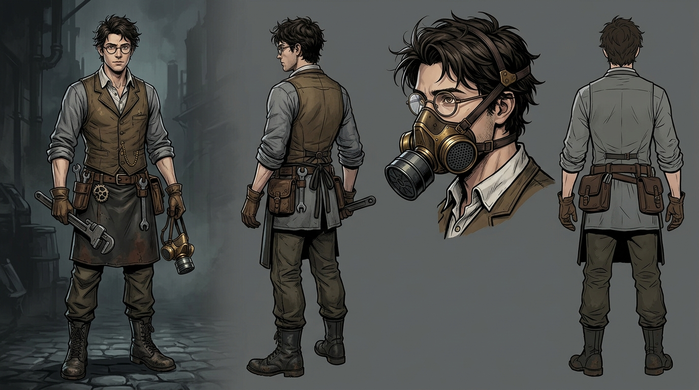 | 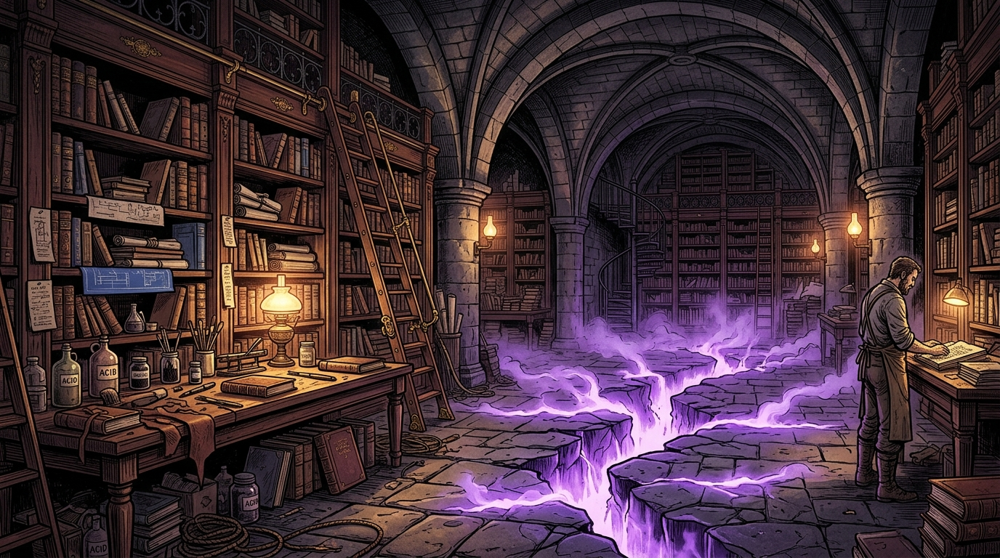 | 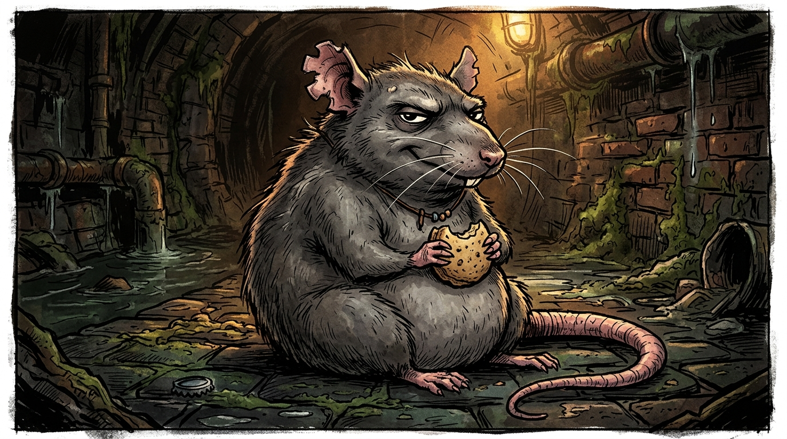 |

---

## Illustrated Story

### Scene 1: The Tuesday Interruption

The end of the world started on a Tuesday, and Arthur Vance was mostly annoyed that it interrupted his shelving.

He stood on the fourth rung of a rolling wooden ladder, deep in the chilly sub-basement of the Grand Municipal Library. In his hands was an old, battered guide on mine tunnels and furnace ventilation. It belonged on the top shelf, squeezed between an outdated metallurgy manual and a grease-stained book on steam boilers.

He was currently on page 312.

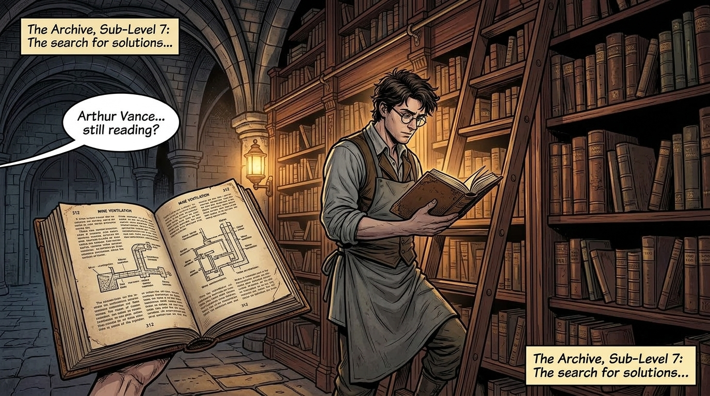

***

### Scene 2: Acid-Free Propriety

Arthur adjusted his wire-rimmed glasses with the back of his wrist, reached into his smock, and carefully inserted a clean, acid-free cardstock bookmark. Dog-earing a page, in Arthur's professional opinion, was a moral failing only slightly less offensive than arson.

To the head librarian, Arthur was merely the quiet assistant who took thirty minutes too long to sweep the floors. In reality, Arthur took thirty minutes too long because he refused to put away any book he had not finished reading. Over five years in the archives, he had read practically every manual, blueprint, and forgotten trade journal in the building. He knew how old timber held up under weight, which cleaning chemicals could dissolve copper pipes, and when an odd creak in the floorboards was something to worry about.

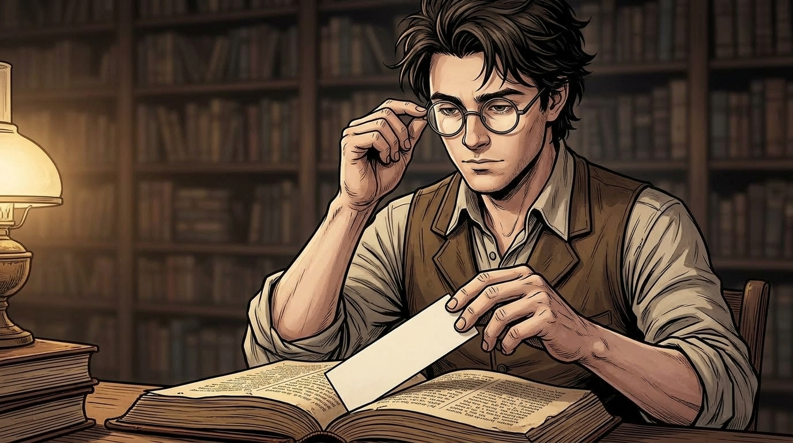

***

### Scene 3: The First Shockwave

And right now, the floor was doing a lot more than creaking.

*Crack.*

The sound rattled right up through the heels of his boots, vibrating straight into his molars. Mortar dust rained down from the ceiling arches like gray snow.

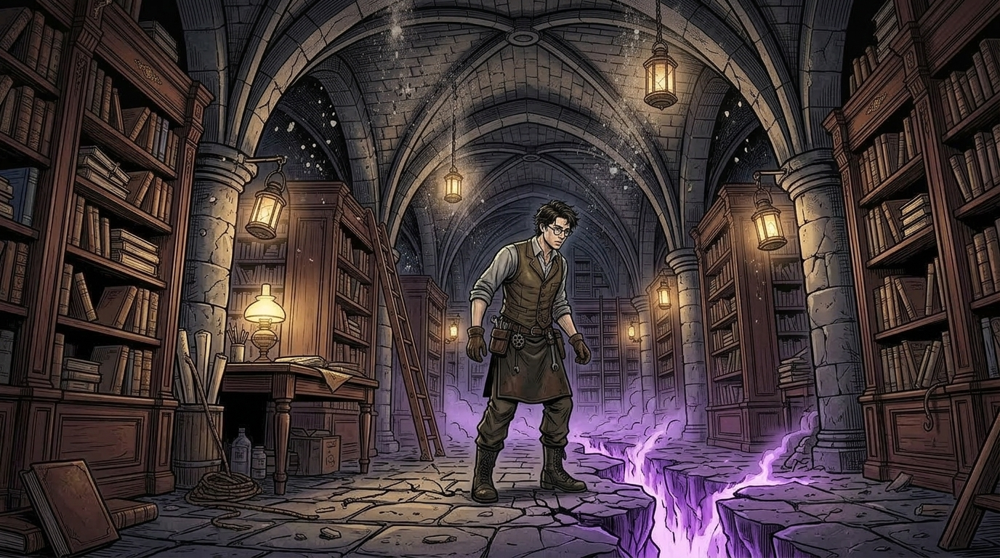

***

### Scene 4: Barbarians

Across the aisle, an entire row of 1880s municipal tax ledgers leaped off the mahogany shelves and crashed onto the floor.

Arthur winced in genuine physical pain. "Those are hand-stitched leather bindings," he muttered, shaking his head. "Barbarians."

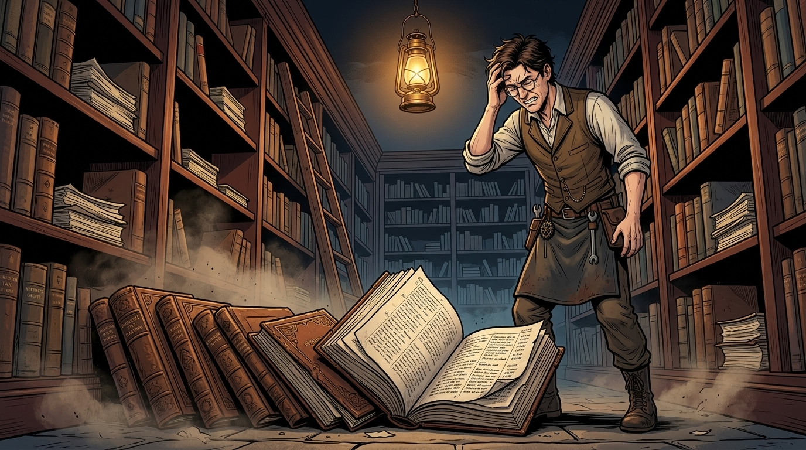

***

### Scene 5: Four-Second Intervals

He didn't panic. Panic raised your pulse, wasted breath, and accomplished nothing. Instead, he climbed down the rolling ladder with practiced calm, pulled his brass pocket watch from his vest, and clicked the timer. Exactly four seconds between tremors. 

He knelt down and laid his palm flat against the stone floor.

The stone was hot. Not warm—hot. Granite wasn't supposed to heat up like an iron stove. And it definitely wasn't supposed to thrum with a slow, heavy rhythm, like a giant heart beating somewhere under the city.

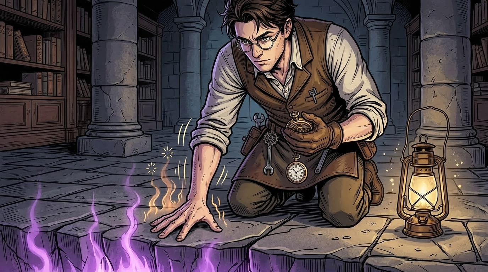

***

### Scene 6: The Rupture of Section 14

Then the floor tore open.

With a shriek like ripping metal, a jagged four-inch crack split the stones straight down the center of the archive, tearing from the emergency fire door all the way through Section 14.

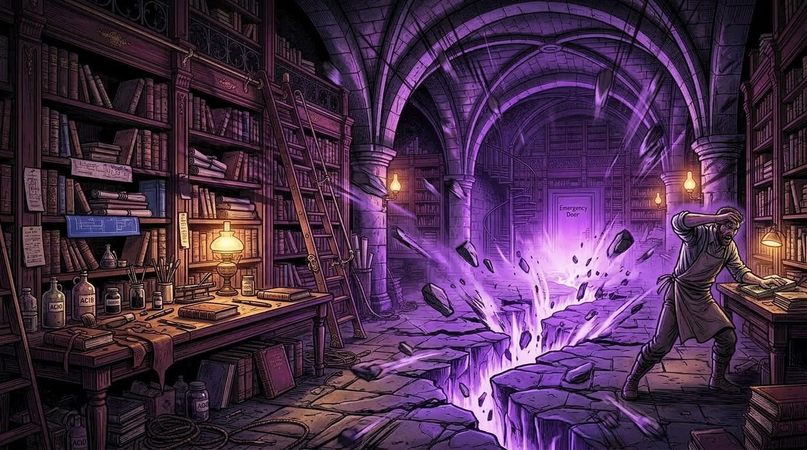

***

### Scene 7: Creeping Folklore

Out of the trench rolled a thick, shimmering purple fog. It spilled across the floorboards like cold liquid, pooling around his boots. The second it touched the cellar air, the room filled with the smell of rotting jasmine mixed with burnt copper.

*The excavation codex wasn't a fairy tale,* Arthur thought, his eyes narrowing behind his glasses.

Six months ago, he had restored a torn parchment salvaged from a subway dig outside town. The text had warned of ancient planetary veins breaking open, and a foul purple mist that woke the beast inside mortal blood. At the time, Arthur had filed it under 'Unsubstantiated Regional Folklore.'

Apparently, Folklore was currently creeping up his ankles.

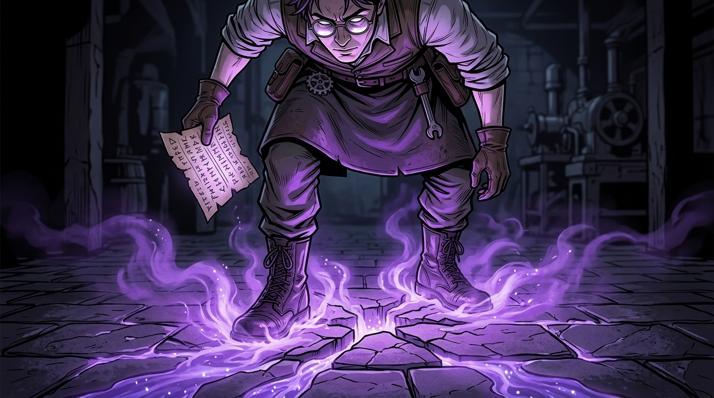

***

### Scene 8: Chaos on the Ground Floor

Upstairs, the screaming started.

It began as a muffled stampede on the main floor—chairs flipping over, university students shouting, crowds rushing the revolving brass doors. But within seconds, the cries changed. The human shrieks warped into wet, guttural howls, punctuated by the unmistakable crunch of splintering desks and snapping bone.

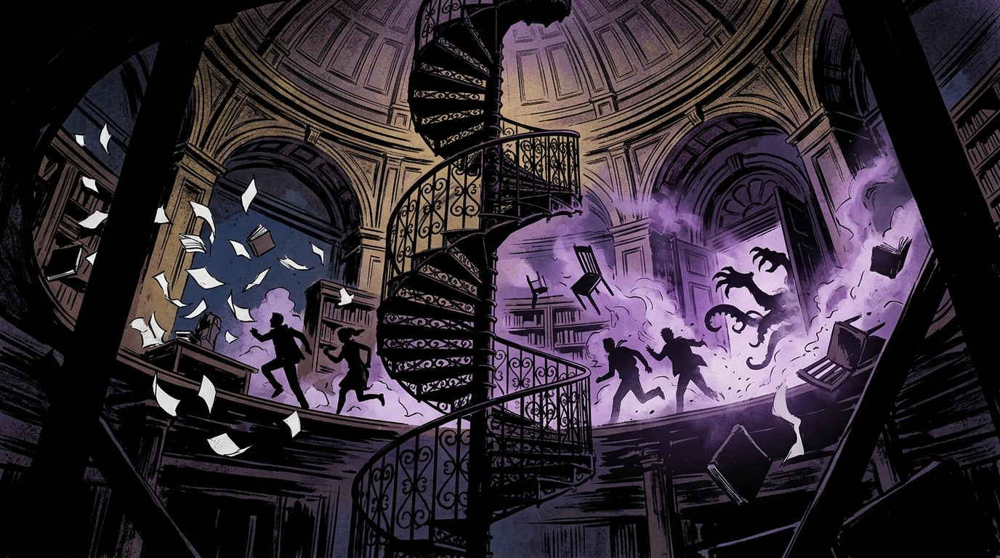

***

### Scene 9: The Civil Defense Broadcast

Arthur pulled a battered brass pocket radio from his smock. It was an antique receiver he had repaired himself using spare copper wire and scavenged capacitors. He flicked the switch, grimacing as high-pitched static shrieked from the speaker:

"—urgent alert from Civil Defense! Catastrophic subterranean ruptures reported across all metropolitan sectors! Stay indoors and avoid contact with the purple mist! Repeat, do not inhale the haze—"

The signal popped with violent interference. A dispatcher's panicked scream cut through the background:

"—containment failure at St. Jude Clinic! Medical Ward 4 has been breached! The fever ward patients are reacting to the air—their vitals are spiking off the charts, we can't hold the doors—"

The broadcast died with a sharp *zap*, replaced by the dull hum of an empty carrier wave. Arthur's knuckles turned white around the radio casing.

*St. Jude Clinic. Ward 4.*

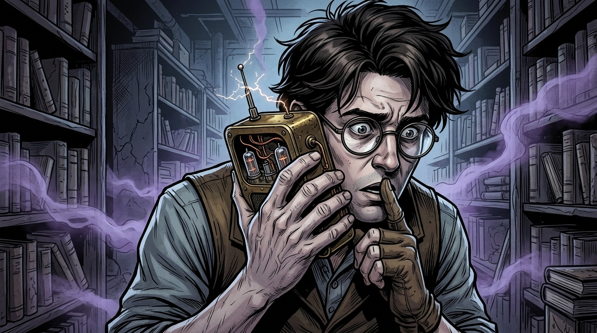

***

### Scene 10: Eleanor and the Luminous Veins

Four miles west. Straight through the densest commercial strip in the city.

His fifteen-year-old sister, Eleanor, had spent the last three years trapped in Ward 4. The doctors had labeled her condition an incurable, unexplained fever. Her skin ran hot as a furnace day after day, and whenever the attacks peaked, glowing blue lines traced beneath her skin like luminous thread. None of their medicines worked. Two days ago, the chief physician had quietly taken Arthur aside and warned him that her body couldn't endure much more.

*It was never a disease,* Arthur realized, cold determination settling behind his ribs. *Her body was reacting to the sleeping energy beneath the earth.*

If that purple fog reached her ward, the fever would overwhelm her system. He had hours—maybe two days at the absolute most—before she slipped away for good.

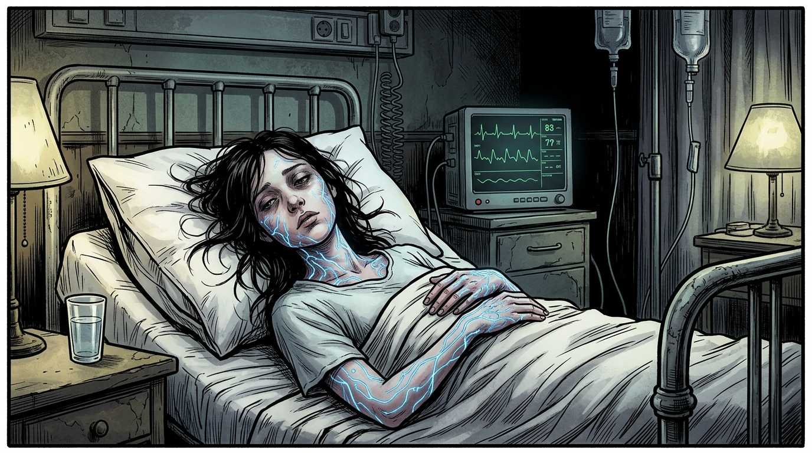

***

### Scene 11: Arthur's Resolve

"Right," Arthur said aloud, his voice steady, flat, and completely devoid of drama. "Step one: don't breathe the purple stuff. Step two: get to Eleanor. Step three: hit whatever gets in the way with a wrench."

The purple haze was already swirling around his knees.

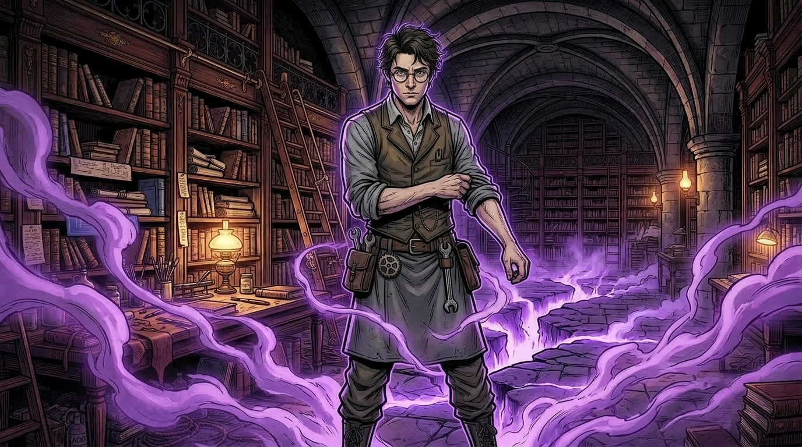

***

### Scene 12: The Workbench Artificer

Arthur turned toward his workbench. On the table sat his daily book-restoration tools: jars of crushed charcoal used for drying damp paper, linen wraps, and an old brass workshop mask with a twist-off filter canister.

He moved with brisk efficiency, though he couldn't help muttering complaints under his breath. "Old Man Henderson still hasn't returned my good rubber goggles. If I mutate into a lizard, I'm haunting his tea cupboard."

He scooped two generous heaps of crushed charcoal into the canister. Charcoal was simple, but nothing beat it for trapping heavy toxins. Next, he soaked a thick cotton cloth in vinegar to neutralize the acidic sting of the vapor, packed it firmly over the carbon, and screwed the brass mesh cap shut.

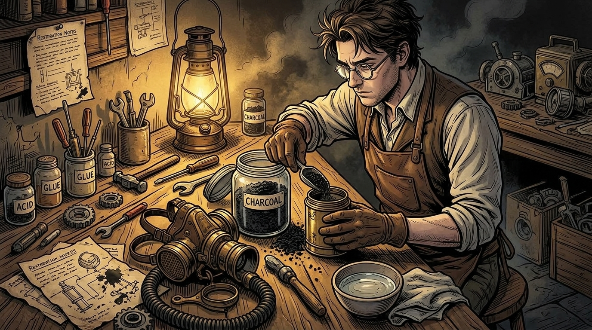

***

### Scene 13: Gearing Up

He pulled the mask over his face and cinched the leather straps tight behind his ears.

He inhaled.

The air entered his lungs cool, dry, and clean. No jasmine rot. No metallic burn.

*Not bad for ninety seconds of work,* he thought.

He slipped the ancient parchment fragment into an oiled leather pocket inside his smock, along with his pocket watch. Then he reached under the workbench and picked up his favorite tool: a fourteen-inch, drop-forged steel pipe wrench with a reassuringly heavy grip.

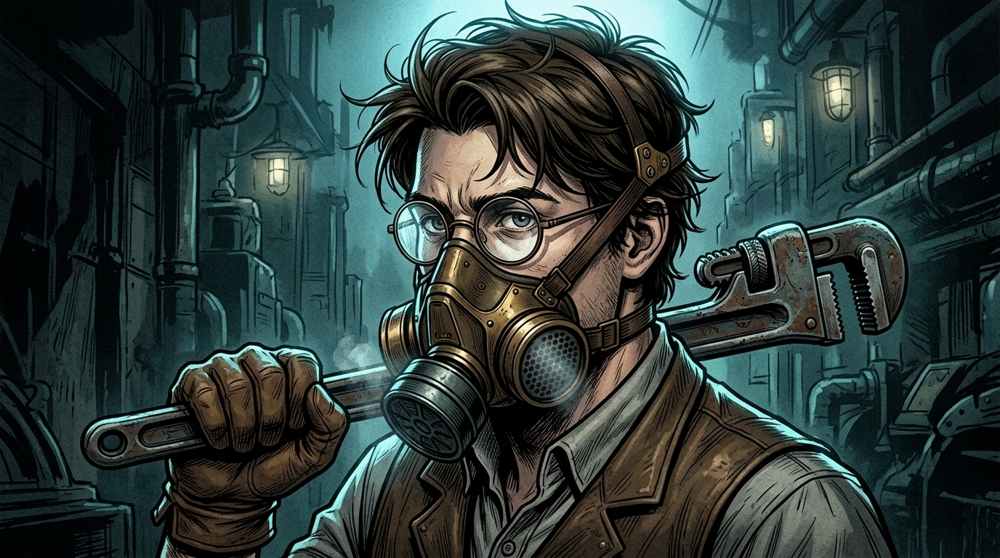

***

### Scene 14: Splintered Oak

Before he could take three steps toward the back exit, the heavy oak door leading upstairs rattled.

*BANG.*

The iron bolt sheared clean off. The wood splintered into kindling, and a monstrous shape forced its way through the jagged opening into the cellar.

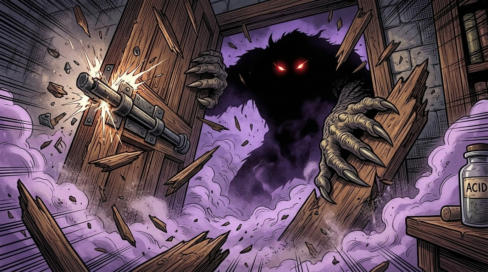

***

### Scene 15: Mutated Bob

It had been Bob, the library’s daytime security guard, about ten minutes ago. Now, Bob's navy uniform hung in bloody ribbons over a terrifyingly swollen frame. His right shoulder had mutated into a mountain of raw muscle covered in thick, rough black scales. His jaw was dislocated and stretched wide, bristling with needles of jagged teeth, and his eyes were completely milky white, blind and weeping yellowish fluid.

The beast lowered its massive snout, sniffing the cellar air with wet, rattling snorts.

Arthur stood frozen behind the workbench.

*Well, Bob’s posture hasn’t improved, but he certainly put on muscle,* Arthur thought, his mind rapidly cataloging the threat. *Completely blind. Hunting by scent and footstep vibrations. Shoulders are plated in armor thick as tree bark, but the throat... the throat is pale cartilage. Totally unprotected.*

The mutated guard took a heavy, dragging step forward, its four-inch claws carving deep grooves into the stone flagstones.

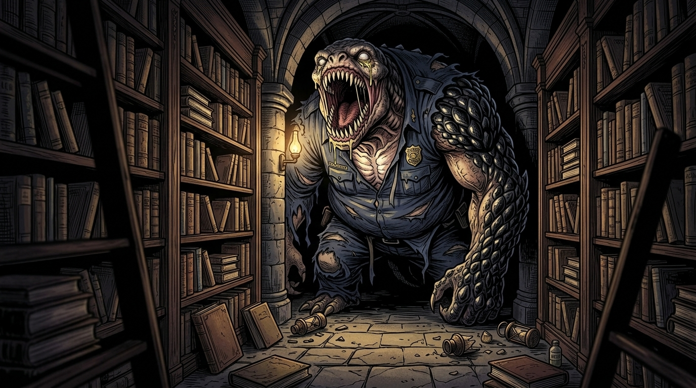

***

### Scene 16: Chemistry Over Magic

Arthur looked down.

Right by his boot was an open sack of quicklime—the dry white masonry powder the cellar maintenance crew used to soak up wall moisture. And on the shelf right above it sat two heavy glass jugs of industrial muriatic acid, used to clear mineral scale from the sewer pipes.

Arthur had no magic powers, and he certainly had no divine martial arts. But he knew what happened when strong acid hit dry masonry lime.

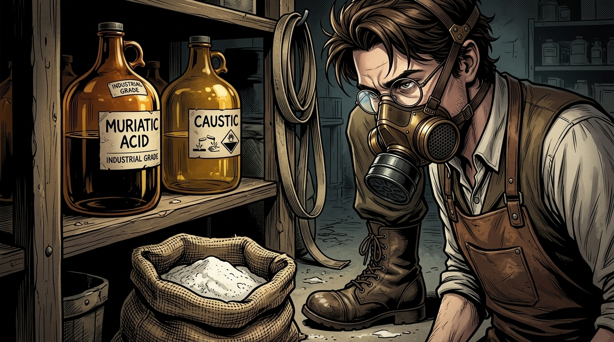

***

### Scene 17: Calfskin Priorities

Before doing anything rash, Arthur carefully picked up a rare 1740 municipal ledger from the lower counter and moved it two shelves higher, out of the splash zone. *Acid stains never come out of calfskin.*

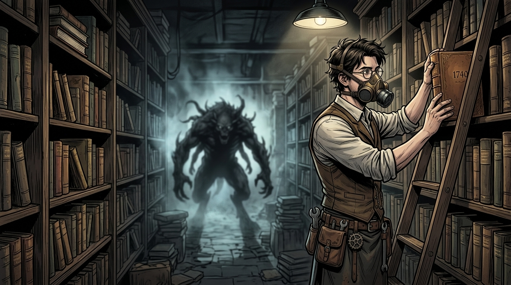

***

### Scene 18: The Quicklime Trap

Then, with a casual nudge of his boot, he kicked the sack of quicklime over.

A thick pile of white powder spilled across the damp stones directly in front of the counter.

The rustle of the canvas sack immediately caught the monster's ear. It let out a deafening screech and lunged across the aisle, claws raised to shred him.

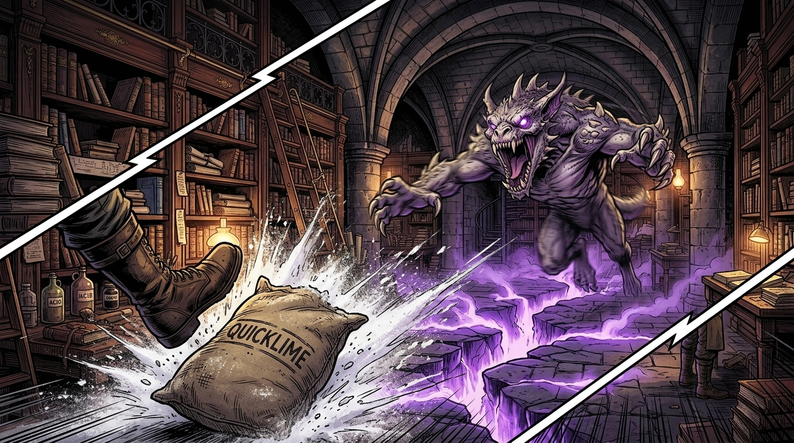

***

### Scene 19: The Acid Strike

Arthur hoisted the heavy jug of acid and hurled it straight down into the white mound.

*SMASH.*

The glass shattered. The acid flooded the dry powder.

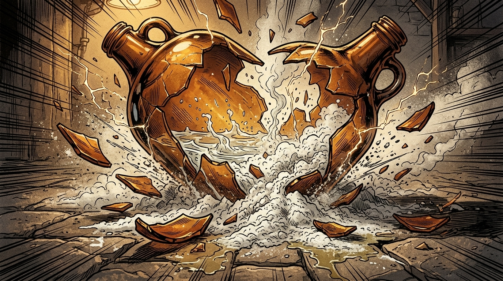

***

### Scene 20: The Caustic Geyser

The reaction was instantaneous, violent, and utterly unforgiving. A roaring, boiling geyser of caustic white steam erupted into the air, expanding like an explosion between the bookshelves.

The monster charged headfirst into the blinding cloud.

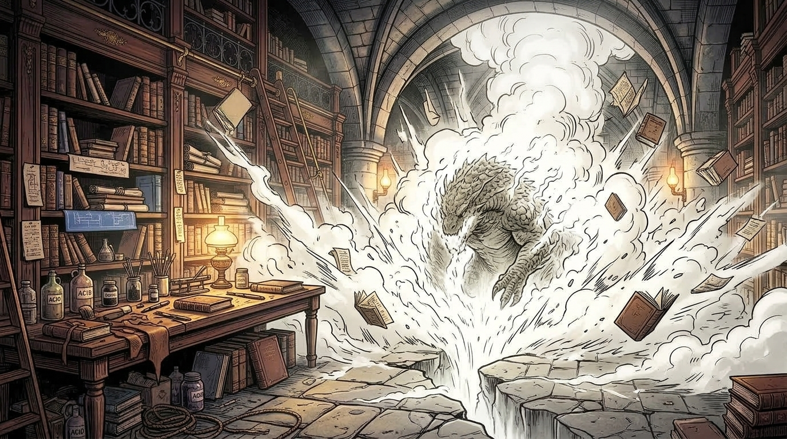

***

### Scene 21: Caloric Expenditure: Minimal

It took a single, massive breath of the boiling fumes. The caustic mist seared straight through its raw throat. The beast's roar choked off into a strangled gurgle. It clawed frantically at its own neck, thrashing against the oak counters as its swollen airway clamped completely shut.

*THUD.*

The eight-foot beast crashed face-first onto the stones, its hind legs twitching twice before going completely, beautifully still.

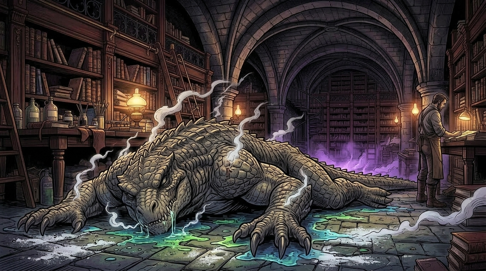

***

### Scene 22: Three Point Eight Seconds

Arthur lowered his wrench, tapped the stopwatch, and nodded. "Quicklime and pipe acid. Total elapsed time: three point eight seconds. Caloric expenditure: minimal."

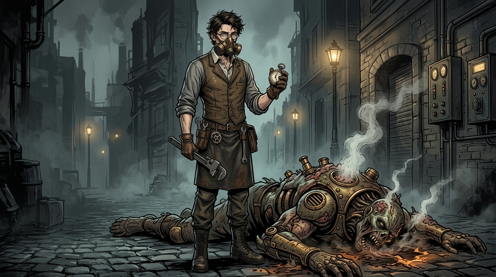

***

### Scene 23: The Survivors Arrive

Before the white steam had even begun to clear, the rear fire door clattered open.

"Down here! The main hall is crawling with them!"

Three people tumbled into the archive: a university student clutching a bleeding elbow, a sobbing young librarian, and the chief library clerk. They scrambled through the gloom, coughing in the thin edges of the purple fog, their faces white with terror.

Then they froze.

Through the drifting white smoke, they saw the eight-foot, black-scaled nightmare sprawled dead on the flagstones.

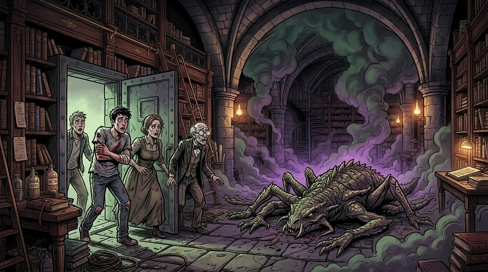

***

### Scene 24: Barnaby Claims the Kill

And standing squarely on top of the monster's chest—sniffing its ear with twitching whiskers—was **Barnaby**.

Barnaby was a fat, one-eared gray sewer rat who had lived behind the Section 8 history stacks for three years. Arthur occasionally shared crusts of sourdough bread with him during graveyard shifts. Right now, Barnaby was simply looking for fallen crumbs, completely indifferent to the giant corpse beneath his paws.

Arthur was kneeling behind the counter, shaking shards of broken glass out of his cuffs.

> *[Pending Quota Reset: Scene 24 - Barnaby the fat one-eared rat perched triumphantly on the dead monster's chest, sniffing for crumbs while Arthur brushes glass from his cuffs in the background.]*

***

### Scene 25: The Sacred Rat of Section 14

"Merciful heavens..." the chief clerk whispered, his jaw dropping in religious terror. "The monster... it's slain!"

"Look!" the student screamed, pointing a shaking finger directly at Barnaby. "Look at the beast's chest! That rat... it's standing over its kill!"

"An omen!" the librarian wept, falling to her knees on the dusty rug with hands clasped in prayer. "The founding fathers have sent an ancient guardian familiar to protect the stacks! All praise the Sacred Rat of Section 14!"

Barnaby sneezed, found a crumb of dry biscuit near the monster's torn collar, gripped it in both paws, and looked directly across the room at Arthur. 

The fat rat didn't blink. His expression radiated pure, arrogant condescension, as if to say: *You see this, Arthur? They respect real talent.*

Then Barnaby turned around and waddled victoriously back into a crack in the wainscoting.

> *[Pending Quota Reset: Scene 25 - Survivors on their knees worshiping the "Sacred Rat of Section 14" while Barnaby casts an arrogant, condescending smirk directly at Arthur.]*

***

### Scene 26: Disrespecting the Savior

Arthur slowly stood up from behind the workbench, holding his pipe wrench, his gray smock completely covered in white lime dust.

"Hey, hold on a second," Arthur said, his muffled voice perfectly deadpan behind the mask. "That wasn't the rat. I tipped forty pounds of masonry lime and broke a jug of cleaning acid. The chemical steam choked its trachea—"

"Silence, boy!" the clerk barked, waving his arms with frantic fury. "Do not disrespect our holy savior with your petty excuses! Grab a broom and sweep up that sacred white dust before the guardian spirit returns! Everyone, into the tunnel before more demons arrive!"

The three survivors scrambled past him into the maintenance corridor, loudly singing praises to the legendary one-eared rat that had single-handedly delivered them from evil.

> *[Pending Quota Reset: Scene 26 - Arthur standing covered head-to-toe in white lime dust holding his wrench, deadpan behind his respirator as the clerk furiously scolds him to grab a broom.]*

***

### Scene 27: The Sign-Out Ledger

Arthur stood alone in the quiet cellar.

Behind his spectacles, his left eyelid gave a slow, deliberate twitch.

He looked at his pipe wrench. He looked at the smoking puddle of acid. He looked at the tiny mouse hole in the wainscoting where Barnaby had disappeared with his biscuit.

"...A rat," Arthur muttered into his mask. "They honestly believe a fat sewer rat executed an eight-foot mutated biped with an arterial strike. Outstanding. I work with lunatics."

He shook his head, checked his pocket watch, and took a breath.

Forty-seven hours left.

Arthur slung his canvas bag over his shoulder, verified his spare filters and tools, and walked over to the employee time-clock near the fire exit. 

He picked up the small pencil on a string and neatly filled out the paper sign-out ledger:

*Name: Vance, Arthur*  
*Time: 2:14 PM*  
*Reason: Unscheduled apocalypse. Stepping out to save sister. Will finish shelving Section 14 upon return.*

> *[Pending Quota Reset: Scene 27 - Close-up of Arthur's hand neatly writing "Reason: Unscheduled apocalypse. Stepping out to save sister" on the library employee sign-out card with a dull pencil on a string.]*

***

### Scene 28: Out Into the Ruins

He clicked the pencil back into its clip, adjusted his glasses, and kicked open the heavy iron door leading out to the avenue.

The sky above the city was bruised purple. Sirens wailed across the rooftops.

Arthur gripped his wrench, pulled down his mask, and stepped out into the ruins of the world.

> *[Pending Quota Reset: Scene 28 - Wide dramatic exit shot: Arthur stepping out through the heavy iron door into the street under a bruised purple apocalyptic sky, wrench gripped firm, mask locked on, ready to fight for his sister.]*

